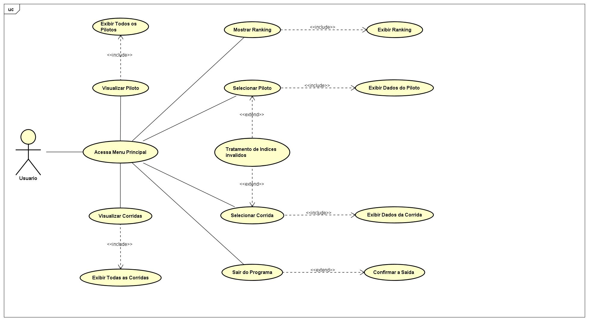

<h1 align="center">
    Fórmula E - Dados Sobre Temporada
</h1>

  <a href="#participantes">Participantes</a> |
  <a href="#descrição-do-projeto">Descrição</a> |
  <a href="#menu-de-informações">Menu de Informações</a> |
  <a href="#estrutura-do-código">Estrutura do Código</a> |
  <a href="#exceções">Exceções</a>

## Participantes
1ESPI - Engenharia de Software
* João Henrique Sena Hoffmann (RM550763)
* Lucas Ludovico Cabral (RM554589)
* Rafael Teofilo Lucena (RM555600)
* Vinicius Fernandes Tavares Bittencourt (RM558909)
* Weslley Oliveira Cardoso (RM557927)

### Link Repositório
https://github.com/uBittencourt/Python-Mahindra

## Descrição
O projeto apresentado tem como objetivo informar ao usuário que irá utilizar sobre as informações da temporada da Fórmula E, como o ranking dos pilotos, informações sobre as corridas que aconteceram na temporada e dados sobre cada piloto. Afim de, poder atrair o público com uma boa gama de informações.

## Diagrama de Caso de Uso

## Menu de Informações
O menu apresentado ao usuário ao iniciar o projeto, contém as seguintes funcionalidades:
* **Visualizar Pilotos**: Lista todos os pilotos participantes da temporada.
* **Selecionar Piloto**: Permite visualizar dados detalhados de um piloto específico.
* **Visualizar Corridas**: Lista todas as corridas que aconteceram na temporada.
* **Selecionar Corrida**: Permite visualizar dados detalhados de uma corrida específica.
* **Mostrar Ranking**: Exibe o ranking atual dos pilotos com base em suas pontuações na temporada.
* **Sair**: Encerra o programa.

## Estrutura do Código
O código consiste, no armazenamento das informações, dentro de um módulo específico, e o consumo destes dados dentro do módulo principal, com as seguintes funções:
* **calcular_pontuacao**: Calcula os pontos dos pilotos com base nos resultados das corridas.
* **apresentar_pilotos**: Apresenta a lista de pilotos participantes da temporada.
* **apresentar_corridas**: Apresenta a lista de corridas da temporada.
* **dados_piloto**: Exibe os detalhes de um piloto específico.
* **dados_corrida**: Exibe os detalhes de uma corrida específica.
* **mostrar_ranking**: Exibe o ranking dos pilotos com base em suas pontuações.
* **Menu Interativo**: Um loop que permite ao usuário interagir com o programa selecionando diferentes opções do menu.

## Exceções
O código implementa tratamento de exceções para garantir uma melhor experiência do usuário. As seguintes exceções são tratadas:
* **ValueError**: Capturada ao tentar converter entradas do usuário em números inteiros. Exibida quando o valor fornecido não é um número válido.
* **TypeError**: Capturada quando o usuário fornece um índice ou valor negativo, que não é permitido. Mensagens apropriadas são exibidas para informar ao usuário sobre a entrada correta.
* **IndexError**: Capturada quando o usuário tenta acessar um índice que não existe na lista de pilotos ou corridas, garantindo que a aplicação não quebre e fornecendo um feedback adequado.

## Execução do Programa
Para iniciar o programa, execute o script Python. Você será recebido por um menu interativo onde poderá escolher entre as opções disponíveis.

